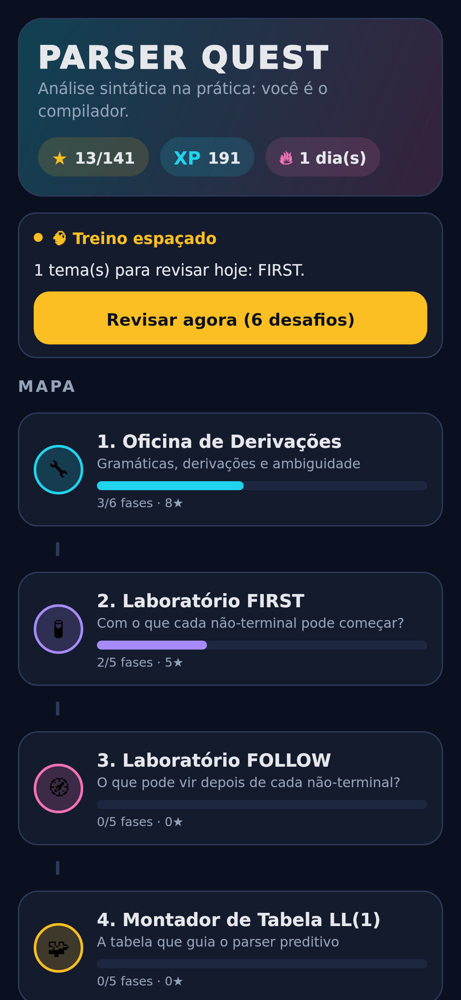
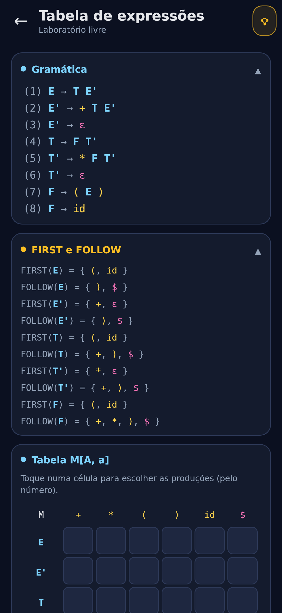
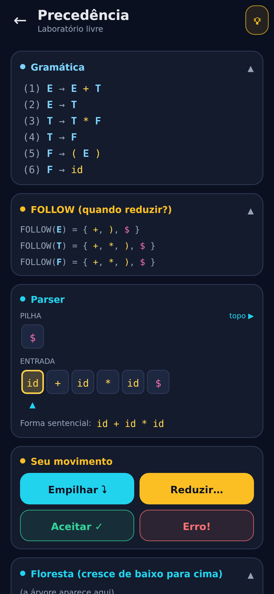
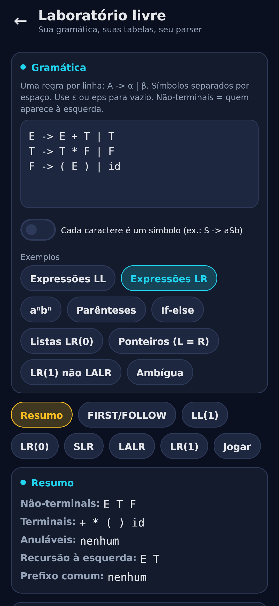

# Parser Quest — aprenda análise sintática jogando

Jogo Android (Kotlin + Jetpack Compose) para aprender a parte de **análise sintática** de Compiladores:
gramáticas e derivações, **FIRST/FOLLOW**, **tabela LL(1)**, **parser top-down preditivo**,
**recursão à esquerda e fatoração**, **shift-reduce**, **itens LR(0)**, **tabela SLR** e
a hierarquia **LL(1) / LR(0) / SLR / LALR / LR(1)**.

Não é um jogo de "complete a lacuna": em quase todas as fases **você é o algoritmo**. Você deriva,
monta os conjuntos, preenche a tabela, move a pilha, empilha e reduz. O jogo confere cada decisão com
um motor de parsing de verdade e explica o erro com a regra correspondente.

O projeto Android fica em [`Compiladores/`](Compiladores/).

<p>




</p>

## Os 9 mundos (47 fases)

| Mundo | O que você faz |
|---|---|
| 1. Oficina de Derivações | Transforma `S` na cadeia-alvo escolhendo produções (mais à esquerda, mais à direita ou livre). Um verificador detecta **becos sem saída** na hora. As fases de "caçador de ambiguidade" pedem **duas árvores diferentes** para a mesma cadeia (`id + id * id`, *dangling else*). |
| 2. Laboratório FIRST | Marca os terminais de cada FIRST numa grade. Inclui o "vazamento do ε" e o ponto fixo com recursão. |
| 3. Laboratório FOLLOW | Mesma mecânica para FOLLOW; na última fase os FIRST somem da tela. |
| 4. Montador de Tabela LL(1) | Preenche `M[A, a]` e dá o **veredito**: é LL(1)? Há conflitos escondidos atrás de ε e o if-then-else. |
| 5. Você é o Parser: Top-Down | Pilha + entrada + árvore crescendo de cima para baixo. Você escolhe cada expansão/casamento, e às vezes o jogo pergunta **por quê** (regra do FIRST ou do FOLLOW?). Tem fase de detectar erro no token exato e fase **sem a tabela**. |
| 6. Cirurgia de Gramáticas | Edita a gramática numa "mesa de cirurgia" para tirar recursão à esquerda e fatorar. O verificador aceita **qualquer solução correta**: sem recursão à esquerda, **mesma linguagem** (compara todas as cadeias até N tokens e mostra um contraexemplo) e, quando pedido, LL(1). |
| 7. Shift-Reduce: Bottom-Up | Empilha, reduz e caça *handles*, com a floresta crescendo de baixo para cima. Primeiro só com FOLLOW, depois com estados e tabela SLR. |
| 8. Fábrica de Itens LR | Coloca os pontos (•) para montar `closure` e `goto`, preenche ACTION/GOTO e localiza o conflito SLR da gramática `L = R`. |
| 9. O Classificador (chefão) | Marca a quais classes cada gramática pertence (LL(1), LR(0), SLR, LALR, LR(1)), incluindo um caso LR(1) que não é LALR e a gramática ambígua. |

Além das fases:

- **Treino espaçado**: sessões de 6 desafios gerados automaticamente a partir das gramáticas do jogo
  (FIRST, FOLLOW, célula da tabela, próximo passo LL, próximo passo SLR, fechamento, ação SLR), intercalando temas.
- **Laboratório livre**: digite a gramática do seu exercício e veja anuláveis, recursão à esquerda,
  FIRST/FOLLOW, tabela LL(1), autômato LR(0), tabelas SLR/LALR/LR(1) com conflitos explicados, e
  **jogue o parser** sobre qualquer cadeia. Serve para conferir lista de exercícios.
- **Diário de bordo**: curva de calibração da confiança, erros mais frequentes por tipo (com estratégia para cada um),
  força de memória por habilidade e temas marcados como confusos.

## A pesquisa por trás do design

Pesquisei ferramentas de ensino de parsing, jogos de lógica/programação e técnicas de metacognição.
O que foi aproveitado:

| Ideia da pesquisa | Como virou mecânica |
|---|---|
| **LLparse/LRparse** e ferramentas como JFLAP e PAVT: o aluno constrói FIRST/FOLLOW, autômato e tabela passo a passo, com feedback em cada etapa | Cada mundo é uma etapa da construção, com correção imediata e explicação da regra |
| **Taxonomia de engajamento de Naps**: só assistir animações quase não ensina; responder, alterar e **construir** ensina | Você nunca só assiste: você executa o algoritmo e constrói as estruturas |
| **Zachtronics** (TIS-100, Opus Magnum), **Turing Complete**: desafios pequenos, várias soluções, pontuação por eficiência | A cirurgia aceita qualquer gramática equivalente; estrelas medem erros e dicas usadas |
| **Baba Is You / Stephen's Sausage Roll**: uma ideia nova por fase, sem enchimento | Cada fase ensina uma ideia e termina com uma "ideia-chave" |
| **Falha produtiva (Kapur)** | Becos sem saída na derivação, contraexemplos na cirurgia e parser que trava quando você reduz na hora errada |
| **Parsons problems / exemplos trabalhados com esmaecimento** | Montar produções com peças; FIRST/FOLLOW visíveis no começo e escondidos depois ("sem rodinhas", "sem tabela!") |
| **Prever → Observar → Explicar** | Fases com previsão antes de jogar, revelada só no final |
| **Autoexplicação** | Perguntas "por que 'x' ∈ FOLLOW(A)?" e "por que essa produção está nessa célula?" |
| **Calibração e repetição baseada em confiança** | Antes de cada verificação você aposta: 🎯 Certeza / 🤔 Acho que sim / 🎲 Chute. O diário mostra quanto você acerta em cada nível, e a revisão espaçada (caixas de Leitner) sobe de caixa só quando você acerta com confiança |
| **Monitoramento dos próprios erros** | Cada erro é classificado ("esqueceu a herança do FOLLOW", "reduziu cedo demais"…) e aparece no diário com uma estratégia |
| **Escada de dicas** | Dica 1 = conceito, 2 = onde olhar, 3 = revelação. Cada dica custa uma estrela, e o jogo pergunta antes: "o que exatamente está travando você?" |

Fontes consultadas:

- [LLparse and LRparse: visual and interactive tools for parsing (SIGCSE 1994)](https://dl.acm.org/doi/10.1145/191033.191121) · [PDF](https://www2.cs.duke.edu/csed/rodger/papers/cse94.pdf)
- [A tool for visualisation of parsers: JFLAP](https://www.researchgate.net/publication/310799874_A_TOOL_FOR_VISUALISATION_OF_PARSERS_JFLAP)
- [PAVT: a tool to visualize and teach parsing algorithms](https://link.springer.com/article/10.1007/s10639-018-9739-x)
- [GrammarAnalyzer (LL(1), SLR, LR(1), LALR)](https://github.com/alejandroklever/GrammarAnalyzer)
- [Exploring the role of visualization and engagement in CS education (Naps et al.)](https://dl.acm.org/doi/10.1145/960568.782998) · [Extending the Engagement Taxonomy](http://cs.joensuu.fi/pages/int/pub/myller09.pdf)
- [TIS-100](https://en.wikipedia.org/wiki/TIS-100) · [Opus Magnum e seus histogramas](https://www.pcgamer.com/perfectly-solving-opus-magnums-puzzles-is-impossible-but-thats-ok/) · [Turing Complete](https://blog.kalan.dev/en/posts/2021-10-20-turing-complete-game) · [5 Great Games That Teach Computer Science](https://www.filamentgames.com/blog/5-great-games-teach-computer-science)
- [Puzzle Game Design: princípios e níveis](https://gamedesignskills.com/game-design/puzzle/) · [Review: Baba Is You](https://statelyplay.com/2019/03/15/review-baba-is-you/)
- [Parsons Problems and Beyond (ITiCSE 2022)](https://dl.acm.org/doi/abs/10.1145/3571785.3574127)
- [Productive Failure in Learning Math (Kapur, 2014)](https://onlinelibrary.wiley.com/doi/abs/10.1111/cogs.12107) · [Productive Failure (Kapur & Roll)](https://boldscience.org/wp-content/uploads/2025/04/Productive-Failure.pdf)
- [Metacognition — MIT Teaching + Learning Lab](https://tll.mit.edu/teaching-resources/how-people-learn/metacognition/) · [Fostering Metacognition to Support Student Learning (CBE—LSE)](https://www.lifescied.org/doi/10.1187/cbe.20-12-0289)
- [Student Explanation Strategies in Postsecondary Math and Statistics (autoexplicação)](https://arxiv.org/pdf/2503.19237)
- [Confidence-Based Repetition](https://www.brainscape.com/academy/confidence-based-repetition-definition/) · [Retrieval and Spaced Practice must be combined](https://evidencebased.education/resource/retrieval-and-spaced-practice-study-strategies-that-must-be-combined/)

## Como rodar

1. Abra a pasta `Compiladores/` no Android Studio.
2. Rode a configuração `app` num emulador ou aparelho (minSdk 29).

Testes:

- `./gradlew test`: testes do motor e do conteúdo (`app/src/test`). Eles garantem que **todas as 47 fases
  têm solução**, que as previsões e dicas batem com o motor, que o autômato LR(0) segue a numeração do livro
  do Dragão e que a gramática `L = R` é LALR mas não SLR.
- `./gradlew connectedAndroidTest`: testes de interface (`app/src/androidTest/.../UiFlowTest.kt`) que jogam
  fases inteiras clicando nos botões, calculando cada jogada correta com o motor.

## Estrutura do código

```
app/src/main/java/com/felipe/compiladores/
├── engine/          motor de parsing puro em Kotlin (sem Android)
│   ├── Grammar.kt       leitura de gramáticas ("E -> E + T | T")
│   ├── Analysis.kt      anuláveis, FIRST, FOLLOW, com a justificativa de cada elemento
│   ├── LL1.kt           tabela LL(1) e simulação do parser preditivo
│   ├── LR.kt            itens LR(0)/LR(1), autômatos, tabelas LR(0)/SLR/LALR/LR(1), simulação shift-reduce
│   ├── Derivation.kt    derivações e reconhecedor de Earley (detecção de becos sem saída)
│   ├── Transform.kt     recursão à esquerda, fatoração, comparação de linguagens
│   └── ParseTree.kt     árvore/floresta de derivação e layout
├── game/            regras do jogo
│   ├── Content.kt       mundos, fases, mini-aulas, dicas, previsões
│   ├── Model.kt         perfil, confiança, tipos de erro, habilidades
│   ├── GameState.kt     pontuação, calibração, revisão espaçada (Leitner)
│   ├── Grading.kt       classificação dos erros do jogador
│   ├── Review.kt        gerador de desafios de revisão
│   └── SurgeryCheck.kt  verificador da cirurgia de gramáticas
└── ui/              Jetpack Compose
    ├── App.kt           navegação
    ├── level/           fluxo de fase (previsão → jogo → resultado, escada de dicas)
    ├── games/           os 11 minijogos
    ├── screens/         mapa, mundo, treino, diário, laboratório
    └── components/      pilha, fita de entrada, árvore, tabelas, seletor de itens
```

O perfil fica salvo em `SharedPreferences`, num formato de texto simples (`ProfileCodec`).
