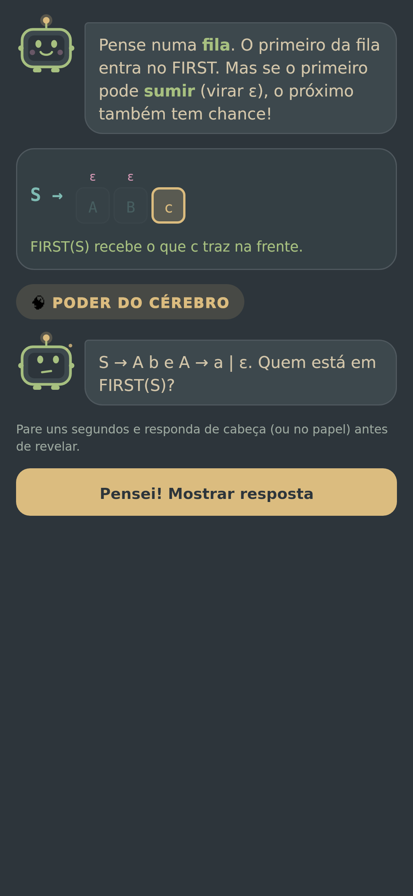
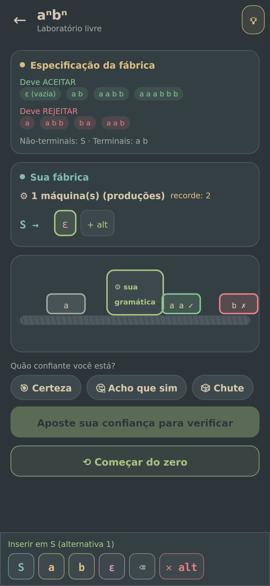
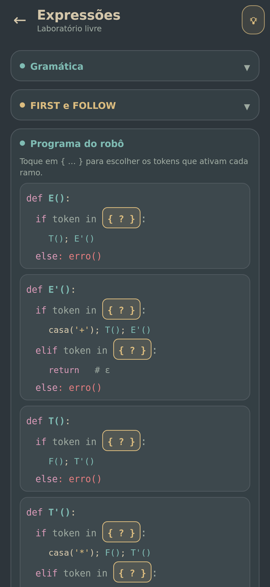
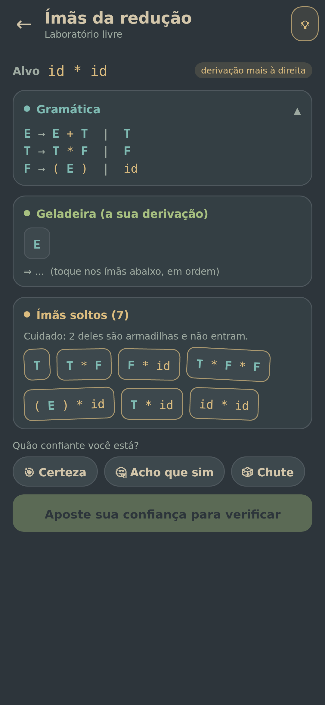
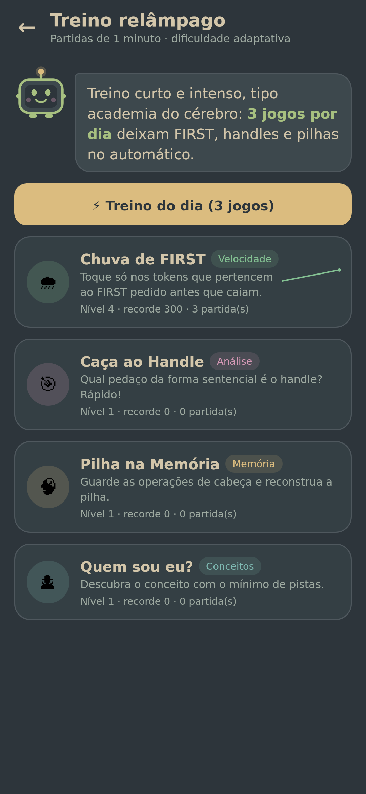
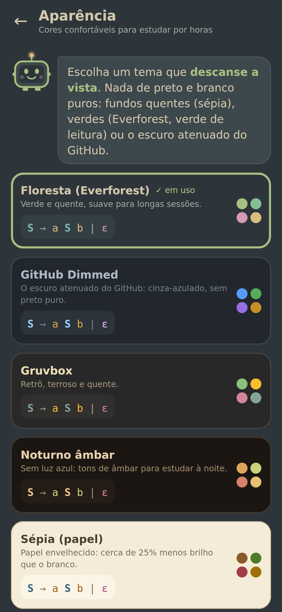
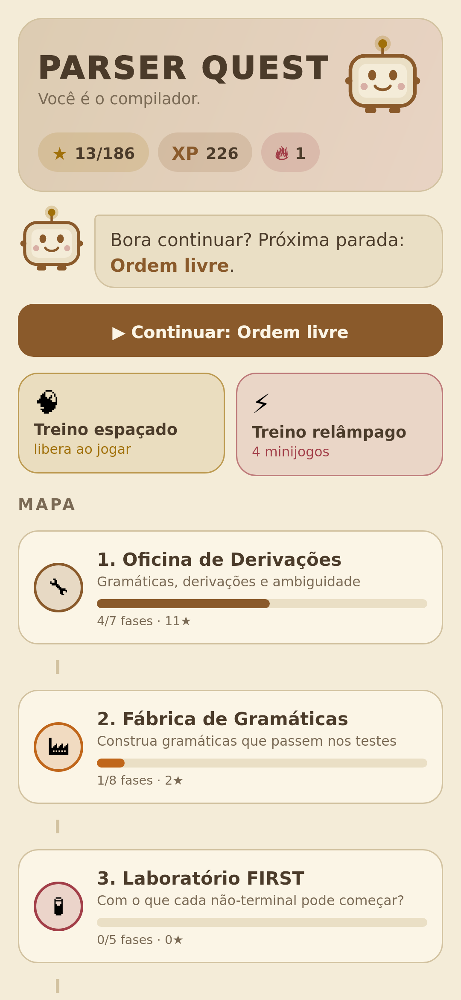

# Parser Quest — aprenda análise sintática jogando

Jogo Android (Kotlin + Jetpack Compose) para aprender a parte de **análise sintática** de Compiladores:
gramáticas e derivações, **FIRST/FOLLOW**, **tabela LL(1)**, **parser top-down preditivo e descendente recursivo**,
**recursão à esquerda e fatoração**, **shift-reduce**, **itens LR(0)**, **tabela SLR** e
a hierarquia **LL(1) / LR(0) / SLR / LALR / LR(1)**.

Não é um jogo de "complete a lacuna": em quase todas as fases **você é o algoritmo** (ou o programa).
O jogo confere cada decisão com um motor de parsing de verdade e explica o erro com a regra correspondente.
Quem conduz tudo é o **Parsy**, um robozinho-parser que conversa com você, comemora e fica triste quando você erra.

O projeto Android fica em [`Compiladores/`](Compiladores/).

<p>




</p>
<p>




</p>

## Os 11 mundos (62 fases)

| Mundo | O que você faz |
|---|---|
| 1. Oficina de Derivações | Deriva cadeias escolhendo produções (à esquerda, à direita ou livre), com **becos sem saída** detectados na hora; caça **duas árvores** para a mesma frase; e monta **ímãs de derivação** (as formas embaralhadas, com peças-armadilha). |
| 2. Fábrica de Gramáticas | *Novo.* Você **constrói gramáticas do zero** para uma especificação: a esteira roda testes (aceitar/rejeitar) e **testes ocultos** que comparam todas as frases curtas. Tem "recorde de máquinas" (produções), como nos jogos da Zachtronics. De "um ou mais a" até expressões sem ambiguidade. |
| 3. Laboratório FIRST | Marca os terminais de cada FIRST numa grade. |
| 4. Laboratório FOLLOW | Mesma mecânica para FOLLOW; na última fase os FIRST somem da tela. |
| 5. Montador de Tabela LL(1) | Preenche `M[A, a]` e dá o veredito: é LL(1)? |
| 6. Você é o Parser: Top-Down | Move a pilha, a árvore cresce de cima para baixo e o jogo pergunta **por quê** (FIRST ou FOLLOW?). Inclui ímãs da derivação à esquerda. |
| 7. Robô Descendente | *Novo* (inspirado em The Farmer Was Replaced). Você **programa um parser descendente recursivo**: cada não-terminal é uma função e você escolhe os tokens de cada `if`. O robô anda pela fita com a pilha de chamadas à mostra, e quando um teste falha o jogo diz qual ramo estava errado. |
| 8. Cirurgia de Gramáticas | Tira recursão à esquerda e fatora numa mesa de edição; qualquer solução correta vale. |
| 9. Shift-Reduce: Bottom-Up | Empilha, reduz e caça *handles*; inclui os ímãs da derivação à direita (lidos de baixo para cima, são as reduções). |
| 10. Fábrica de Itens LR | Coloca os pontos (•) para montar `closure` e `goto`, preenche ACTION/GOTO e acha o conflito SLR. |
| 11. O Classificador | Chefão: a quais classes cada gramática pertence? |

Cada mundo abre com uma **aula ilustrada** curtinha no estilo Head First (veja abaixo).

Além das fases:

- **Treino relâmpago** (*novo*, estilo Peak): 4 minijogos de 1 minuto com **dificuldade adaptativa**, recordes e gráfico de evolução.
  - 🌧️ *Chuva de FIRST* (velocidade): toque só nos tokens que caem e pertencem ao FIRST pedido.
  - 🎯 *Caça ao Handle* (análise): qual trecho da forma sentencial é o handle?
  - 🧠 *Pilha na Memória* (memória): guarde as operações de cabeça e reconstrua a pilha.
  - 🕵️ *Quem sou eu?* (conceitos, um clássico do Head First): descubra o conceito com o mínimo de pistas.
  - O **treino do dia** escolhe 3 jogos; o diário mostra um "mapa do cérebro" com a evolução de cada habilidade.
- **Treino espaçado**: desafios gerados das gramáticas do jogo, intercalando temas, em caixas de Leitner.
- **Laboratório livre**: digite a gramática da sua lista e veja FIRST/FOLLOW, tabelas LL(1)/SLR/LALR/LR(1), autômato LR(0), conflitos explicados — e jogue o parser sobre qualquer cadeia.
- **Diário de bordo**: calibração da confiança, erros mais frequentes por tipo (com estratégia), memória por habilidade e o mapa do cérebro.
- **Aparência** (*novo*): 7 temas pensados contra o cansaço visual, tamanho do texto e opção de reduzir animações.

## Temas anti-cansaço

Nada de azul-padrão nem de preto e branco puros. Os temas são:

| Tema | Por quê |
|---|---|
| **Floresta (Everforest)**, o padrão | Paleta verde e quente, feita para ser suave em sessões longas. |
| **GitHub Dimmed** | O escuro atenuado do GitHub: cinza-azulado, contraste moderado. |
| **Gruvbox** | Retrô, tons terrosos e quentes. |
| **Noturno âmbar** | Quase sem luz azul, para estudar à noite. |
| **Sépia (papel)** | Fundo de papel envelhecido: cerca de 25% menos brilho que o branco. |
| **Verde descanso** | Fundo verde-claro de leitura; um estudo de 2025 associou esse fundo a menos fadiga visual e melhor leitura. |
| **Solarized claro** | Creme com contraste calibrado. |

As cores dos símbolos têm o mesmo papel em todos os temas (não-terminal, terminal, ε/$), para o cérebro associar cor a significado.

## A pesquisa por trás do design

Pesquisei ferramentas de ensino de parsing, jogos de lógica/programação e técnicas de metacognição.
O que foi aproveitado:

| Ideia da pesquisa | Como virou mecânica |
|---|---|
| **LLparse/LRparse** e ferramentas como JFLAP e PAVT: o aluno constrói FIRST/FOLLOW, autômato e tabela passo a passo, com feedback em cada etapa | Cada mundo é uma etapa da construção, com correção imediata e explicação da regra |
| **Taxonomia de engajamento de Naps**: só assistir animações quase não ensina; responder, alterar e **construir** ensina | Você nunca só assiste: você executa o algoritmo e constrói as estruturas |
| **Zachtronics** (TIS-100, Opus Magnum), **Turing Complete**: desafios pequenos, várias soluções, pontuação por eficiência | A cirurgia aceita qualquer gramática equivalente; estrelas medem erros e dicas usadas |
| **Baba Is You / Stephen's Sausage Roll**: uma ideia nova por fase, sem enchimento | Cada fase ensina uma ideia e termina com uma "ideia-chave" |
| **Falha produtiva (Kapur)** | Becos sem saída na derivação, contraexemplos na cirurgia e parser que trava quando você reduz na hora errada |
| **Parsons problems / exemplos trabalhados com esmaecimento** | Montar produções com peças; FIRST/FOLLOW visíveis no começo e escondidos depois ("sem rodinhas", "sem tabela!") |
| **Prever → Observar → Explicar** | Fases com previsão antes de jogar, revelada só no final |
| **Autoexplicação** | Perguntas "por que 'x' ∈ FOLLOW(A)?" e "por que essa produção está nessa célula?" |
| **Calibração e repetição baseada em confiança** | Antes de cada verificação você aposta: 🎯 Certeza / 🤔 Acho que sim / 🎲 Chute. O diário mostra quanto você acerta em cada nível, e a revisão espaçada (caixas de Leitner) sobe de caixa só quando você acerta com confiança |
| **Monitoramento dos próprios erros** | Cada erro é classificado ("esqueceu a herança do FOLLOW", "reduziu cedo demais"…) e aparece no diário com uma estratégia |
| **Escada de dicas** | Dica 1 = conceito, 2 = onde olhar, 3 = revelação. Cada dica custa uma estrela, e o jogo pergunta antes: "o que exatamente está travando você?" |
| **Head First**: visual, conversa em primeira pessoa, emoção, fazer o cérebro trabalhar | Aulas em cenas curtas com o mascote falando (texto curto e imagem **junto** da palavra), animações de cada conceito e um mascote com humor |
| **Head First**: "Poder do cérebro", "Cuidado!", "Não existem perguntas idiotas", "Papo de bastidor", "Pontos-chave" | Os mesmos quadros nas aulas: pausa para pensar antes de revelar, armadilhas comuns, perguntas e respostas, uma conversa LL × LR e o resumo final |
| **Head First**: "Ímãs de código", "Seja o compilador", "Quem sou eu?" | Fases de ímãs de derivação (com armadilhas), fases em que você é o parser e o minijogo Quem sou eu? |
| **Mayer (multimídia)**: segmentar e sinalizar | Uma ideia por cena, com a parte importante em destaque colorido |
| **The Farmer Was Replaced**: aprender programando um robô, com testes | Robô Descendente: você programa o parser recursivo e roda os testes |
| **Mindustry / Zachtronics**: linha de produção, várias soluções, otimização | Fábrica de Gramáticas: cada produção é uma máquina; testes na esteira; recorde de máquinas |
| **Peak**: jogos curtos por habilidade, dificuldade adaptativa, gráficos de evolução | Treino relâmpago com 4 habilidades, nível que sobe ou desce conforme o desempenho e histórico no diário |

Fontes consultadas:

- [LLparse and LRparse: visual and interactive tools for parsing (SIGCSE 1994)](https://dl.acm.org/doi/10.1145/191033.191121) · [PDF](https://www2.cs.duke.edu/csed/rodger/papers/cse94.pdf)
- [A tool for visualisation of parsers: JFLAP](https://www.researchgate.net/publication/310799874_A_TOOL_FOR_VISUALISATION_OF_PARSERS_JFLAP)
- [PAVT: a tool to visualize and teach parsing algorithms](https://link.springer.com/article/10.1007/s10639-018-9739-x)
- [GrammarAnalyzer (LL(1), SLR, LR(1), LALR)](https://github.com/alejandroklever/GrammarAnalyzer)
- [Exploring the role of visualization and engagement in CS education (Naps et al.)](https://dl.acm.org/doi/10.1145/960568.782998) · [Extending the Engagement Taxonomy](http://cs.joensuu.fi/pages/int/pub/myller09.pdf)
- [TIS-100](https://en.wikipedia.org/wiki/TIS-100) · [Opus Magnum e seus histogramas](https://www.pcgamer.com/perfectly-solving-opus-magnums-puzzles-is-impossible-but-thats-ok/) · [Turing Complete](https://blog.kalan.dev/en/posts/2021-10-20-turing-complete-game) · [5 Great Games That Teach Computer Science](https://www.filamentgames.com/blog/5-great-games-teach-computer-science)
- [Puzzle Game Design: princípios e níveis](https://gamedesignskills.com/game-design/puzzle/) · [Review: Baba Is You](https://statelyplay.com/2019/03/15/review-baba-is-you/)
- [Parsons Problems and Beyond (ITiCSE 2022)](https://dl.acm.org/doi/abs/10.1145/3571785.3574127)
- [Productive Failure in Learning Math (Kapur, 2014)](https://onlinelibrary.wiley.com/doi/abs/10.1111/cogs.12107) · [Productive Failure (Kapur & Roll)](https://boldscience.org/wp-content/uploads/2025/04/Productive-Failure.pdf)
- [Metacognition — MIT Teaching + Learning Lab](https://tll.mit.edu/teaching-resources/how-people-learn/metacognition/) · [Fostering Metacognition to Support Student Learning (CBE—LSE)](https://www.lifescied.org/doi/10.1187/cbe.20-12-0289)
- [Student Explanation Strategies in Postsecondary Math and Statistics (autoexplicação)](https://arxiv.org/pdf/2503.19237)
- [Confidence-Based Repetition](https://www.brainscape.com/academy/confidence-based-repetition-definition/) · [Retrieval and Spaced Practice must be combined](https://evidencebased.education/resource/retrieval-and-spaced-practice-study-strategies-that-must-be-combined/)
- [Head First: princípios de aprendizagem (intro do Head First Design Patterns)](https://www.oreilly.com/library/view/head-first-design/9781492077992/preface03.html) · [Head First Agile](https://www.oreilly.com/library/view/head-first-agile/9781491944684/) · [Exercícios "Sharpen your pencil", "Pool Puzzle" (Coderanch)](https://coderanch.com/t/653180/java/Head-Java-edition-Exercises-Sharpen)
- [Mayer's 12 Principles of Multimedia Learning](https://www.digitallearninginstitute.com/blog/mayers-principles-multimedia-learning) · [The Influences of Emotion on Learning and Memory](https://pmc.ncbi.nlm.nih.gov/articles/PMC5573739/)
- [The Farmer Was Replaced (Steam)](https://store.steampowered.com/app/2060160/The_Farmer_Was_Replaced/) · [Thinky Games sobre o jogo](https://thinkygames.com/news/attempt-to-replace-the-farmer-in-this-new-drone-programming-argriculture-game-featuring-its-own-coding-language/)
- [Mindustry: transporte e produção (guia)](https://steamcommunity.com/sharedfiles/filedetails/?id=1997547694) · [Mindustry: processadores lógicos](https://steamcommunity.com/sharedfiles/filedetails/?id=2268059244)
- [Peak – Brain Training (análise)](https://mindtools.io/programs/peak-brain-training/) · [Adaptive difficulty em jogos de treino cerebral](https://dev.to/ranjit_desai/designing-an-adaptive-difficulty-engine-for-20-brain-training-games-3c36)
- [Everforest](https://github.com/sainnhe/everforest) · [Gruvbox](https://gruvbox.org/what-is-gruvbox-complete-guide-to-the-retro-color-scheme/) · [GitHub Primer: uso de cores](https://primer.style/product/getting-started/foundations/color-usage/) · [Reducing Eye Strain](http://stratus3d.com/blog/2022/05/02/reducing-eye-strain/)
- [Light green background enhances reading performance (Frontiers in Psychology, 2025)](https://pubmed.ncbi.nlm.nih.gov/40787116/) · [Sépia × branco: brilho e fadiga](https://techcrawlr.com/which-is-best-for-eyes-while-reading/)

## Como rodar

1. Abra a pasta `Compiladores/` no Android Studio.
2. Rode a configuração `app` num emulador ou aparelho (minSdk 29).

Testes:

- `./gradlew test`: testes do motor, do conteúdo e dos modos novos (`app/src/test`). Eles garantem que **todas as 62 fases
  têm solução** (inclusive que cada fábrica é resolvível com o número "recorde" de produções e que o robô ideal passa em
  todos os testes), que as previsões e dicas batem com o motor, que o autômato LR(0) segue a numeração do livro do Dragão
  e que a lógica dos minijogos relâmpago é consistente.
- `./gradlew connectedAndroidTest`: testes de interface (`app/src/androidTest/.../UiFlowTest.kt`) que jogam fases inteiras
  clicando nos botões, percorrem todas as aulas de todos os mundos, trocam o tema e jogam o treino relâmpago.

## Estrutura do código

```
app/src/main/java/com/felipe/compiladores/
├── engine/          motor de parsing puro em Kotlin (sem Android)
│   ├── Grammar.kt       leitura de gramáticas ("E -> E + T | T")
│   ├── Analysis.kt      anuláveis, FIRST, FOLLOW, com a justificativa de cada elemento
│   ├── LL1.kt           tabela LL(1) e simulação do parser preditivo
│   ├── LR.kt            itens LR(0)/LR(1), autômatos, tabelas LR(0)/SLR/LALR/LR(1), simulação shift-reduce
│   ├── Derivation.kt    derivações e reconhecedor de Earley (detecção de becos sem saída)
│   ├── Transform.kt     recursão à esquerda, fatoração, comparação de linguagens
│   └── ParseTree.kt     árvore/floresta de derivação e layout
├── game/            regras do jogo
│   ├── Content.kt       mundos, fases, dicas, previsões
│   ├── Lessons.kt       aulas ilustradas (cenas no estilo Head First)
│   ├── Model.kt         perfil, configurações, confiança, tipos de erro, habilidades
│   ├── GameState.kt     pontuação, calibração, revisão espaçada, dificuldade adaptativa
│   ├── NewModes.kt      Fábrica (testes), Robô (interpretador) e Ímãs
│   ├── Arcade.kt        lógica dos 4 minijogos relâmpago
│   ├── Grading.kt       classificação dos erros do jogador
│   ├── Review.kt        gerador de desafios de revisão
│   └── SurgeryCheck.kt  verificador da cirurgia de gramáticas
└── ui/              Jetpack Compose
    ├── App.kt           navegação
    ├── theme/           paletas anti-cansaço e tema
    ├── lesson/          player das aulas e ilustrações animadas
    ├── level/           fluxo de fase (previsão → jogo → resultado, escada de dicas)
    ├── games/           os 14 tipos de minijogo das fases
    ├── arcade/          treino relâmpago
    ├── screens/         mapa, mundo, treino espaçado, diário, laboratório, aparência
    └── components/      mascote, animações, pilha, fita, árvore, tabelas, mesa de edição
```

O perfil fica salvo em `SharedPreferences`, num formato de texto simples (`ProfileCodec`).
